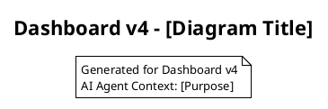
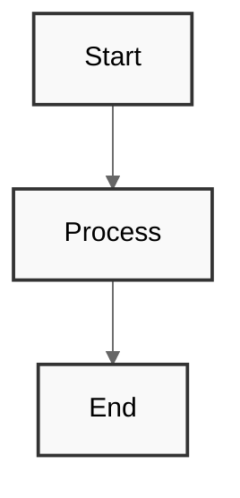

# Visual Documentation - Dashboard v4

This directory contains visual documentation for Dashboard v4, organized to optimize AI coding agent effectiveness and developer understanding.

## 📋 Visual Documentation Philosophy

Dashboard v4 follows a **Comprehensive Visual Documentation** approach with emphasis on:
- **Machine-Readable Formats** using PlantUML and Mermaid for version control
- **Multi-Level Architecture** from system overview to detailed implementation
- **User-Centered Design** documenting both technical and user experience aspects
- **AI Agent Optimization** with clear naming conventions and structured formats

## 🏗 Diagram Architecture

### Visual Documentation Hierarchy
```
diagrams/
├── architecture/     # System-level architectural views
├── uml/             # Detailed UML modeling
├── flowcharts/      # Process and workflow documentation
├── ui-mockups/      # User interface designs and mockups
└── data-models/     # Database and data structure models
```

### Diagram Types and Purposes

| Category | Purpose | Formats | AI Agent Value |
|----------|---------|---------|----------------|
| **Architecture** | System design, infrastructure, service boundaries | PlantUML C4, Mermaid | High-level context for code generation |
| **UML** | Domain modeling, class relationships, sequence flows | PlantUML | Detailed object relationships and interactions |
| **Flowcharts** | Business processes, user workflows, error handling | Mermaid | Process logic and decision tree context |
| **UI Mockups** | Interface designs, user experience flows | PNG, Figma JSON | Visual context for component development |
| **Data Models** | Database schemas, entity relationships | PlantUML ER, Prisma | Data structure context for ORM and queries |

## 📁 Directory Structure Detail

### `/architecture` - System Architecture Views
Focus: High-level system design using C4 Model methodology

**Files:**
- `system-context.puml` - C4 Level 1: System context and external dependencies
- `system-containers.puml` - C4 Level 2: Application containers and databases
- `component-overview.puml` - C4 Level 3: Key component interactions
- `infrastructure.mmd` - Deployment and infrastructure architecture

**Usage:** Provides AI agents with system-wide context for architectural decisions

### `/uml` - Detailed UML Models
Focus: Domain modeling and detailed technical specifications

**Files:**
- `job-domain-model.puml` - Class diagram for job management domain
- `user-workflow-sequence.puml` - Sequence diagram for job approval workflow
- `component-relationships.puml` - Component dependency relationships
- `state-machine.puml` - Job lifecycle state transitions

**Usage:** Enables AI agents to understand detailed object relationships and interactions

### `/flowcharts` - Process Documentation
Focus: Business logic and user journey mapping

**Files:**
- `job-approval-flow.mmd` - Complete job approval business process
- `user-navigation-flow.mmd` - Dashboard navigation and user paths
- `error-handling-flow.mmd` - Error scenarios and recovery processes
- `notification-flow.mmd` - Sound and visual notification logic

**Usage:** Provides AI agents with process context for implementing business logic

### `/ui-mockups` - Interface Documentation
Focus: User interface designs and user experience documentation

**Files:**
- `dashboard-overview.png` - Main dashboard interface design
- `job-card-variants.png` - Job card component states and variations
- `modal-designs.png` - Approval and rejection modal interfaces
- `responsive-layouts.png` - Mobile and tablet layout adaptations
- `design-system.figma.json` - Figma export with design tokens

**Usage:** Gives AI agents visual context for UI component development

### `/data-models` - Data Structure Documentation
Focus: Database design and data relationships

**Files:**
- `job-entity-model.puml` - Entity-relationship diagram for job system
- `database-schema.sql` - Complete database schema definition
- `api-data-models.puml` - API request/response data structures
- `type-definitions.puml` - TypeScript type relationship mapping

**Usage:** Provides AI agents with data structure context for database and API development

## 🎨 Diagram Standards and Conventions

### File Naming Conventions
- **Descriptive names**: Use clear, specific names that describe the diagram's purpose
- **Consistent format**: `[domain]-[type]-[detail].extension`
- **Version neutral**: Avoid version numbers in filenames
- **Hyphen separated**: Use hyphens for multi-word names

### PlantUML Standards


### Mermaid Standards


## 🔧 Diagram Generation and Maintenance

### Local Development Setup
```bash
# Install PlantUML (requires Java)
brew install plantuml

# Install Mermaid CLI
npm install -g @mermaid-js/mermaid-cli

# Generate PNG from PlantUML
plantuml diagrams/architecture/system-context.puml

# Generate PNG from Mermaid
mmdc -i diagrams/flowcharts/job-approval-flow.mmd -o diagrams/flowcharts/job-approval-flow.png
```

### VS Code Integration
Recommended extensions:
- **PlantUML**: Rich PlantUML support with preview
- **Mermaid Preview**: Real-time Mermaid diagram preview
- **Draw.io Integration**: For complex diagrams requiring visual editing

### CI/CD Integration
Automated diagram generation in GitHub Actions:
- Validate diagram syntax on pull requests
- Generate PNG exports for documentation
- Update diagram exports on diagram source changes

## 📊 Diagram Usage Guidelines

### For AI Coding Agents
1. **Context Reference**: Use diagrams to understand system boundaries and relationships
2. **Implementation Guidance**: Refer to UML and flowcharts for detailed implementation logic
3. **Consistency Checking**: Validate code changes against architectural diagrams
4. **Pattern Recognition**: Use diagram patterns for similar implementation scenarios

### For Human Developers
1. **Architecture Understanding**: Start with system-context diagrams for overview
2. **Feature Development**: Reference relevant UML and flowcharts before coding
3. **Code Review**: Use diagrams to validate architectural consistency
4. **Documentation Updates**: Keep diagrams current with code changes

### Diagram Maintenance Workflow
1. **Design Phase**: Create/update diagrams before implementation
2. **Development Phase**: Reference diagrams during coding
3. **Review Phase**: Validate implementation matches diagrams
4. **Update Phase**: Modify diagrams if architectural changes occur

## 🎯 Dashboard v4 Specific Context

### Key System Components
- **Job Management Core**: Central job processing and state management
- **User Interface Layer**: React components for dashboard interaction
- **Notification System**: Sound and visual notification handling
- **State Management**: Job status and filter state coordination
- **API Layer**: Backend integration for job operations

### Critical User Flows
1. **Job Approval Workflow**: From pending to approved with notes
2. **Job Rejection Workflow**: From pending to rejected with reason
3. **Status Filtering**: Dynamic job list filtering by status
4. **Real-time Updates**: Live job status changes and notifications

### Technical Architecture Patterns
- **Component Composition**: Reusable UI components with clear interfaces
- **State Management**: Centralized state with context providers
- **API Integration**: RESTful endpoints with error handling
- **Responsive Design**: Mobile-first with progressive enhancement

## 🤖 AI Agent Integration

### Diagram-to-Code Patterns
The visual documentation enables AI agents to:
- **Generate Components**: Use UI mockups to create React components
- **Implement Workflows**: Translate flowcharts to business logic
- **Design Databases**: Convert ER diagrams to schema definitions
- **Create APIs**: Use sequence diagrams for endpoint implementation

### Context Preservation
Diagrams serve as **persistent context** that helps AI agents:
- Maintain architectural consistency across sessions
- Understand system relationships without re-analysis
- Generate code that fits existing patterns
- Validate changes against established design

---

This visual documentation strategy ensures Dashboard v4 maintains clear, consistent, and AI-agent-friendly architectural documentation throughout development and maintenance phases. 